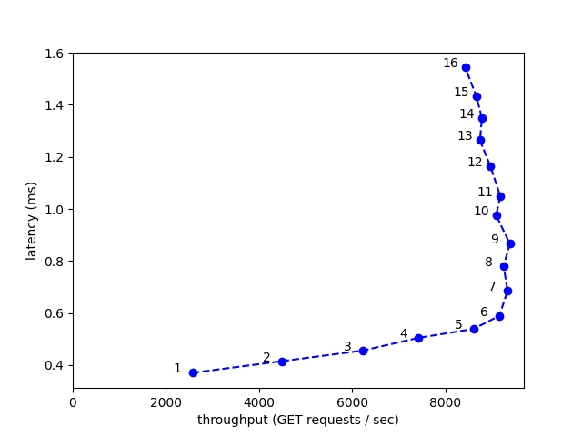

# dqlite
* canonical/raft: https://github.com/canonical/raft
* canonical/dqlite: https://github.com/canonical/dqlite
* canonical/go-dqlite: https://github.com/canonical/go-dqlite

**canonical/dqlite** is a C library that implements an embeddable and replicated SQL database engine with high-availability and automatic failover based on **canonical/raft**.
In addition, **canonical/go-dqlite** is a pure-Go client for the dqlite wire protocol.

# Repo structure
* **Dockerfile:** File to build dqlite docker image.
* **docker-compose.yml:** Setup a 3-node dqlite clusters.
* **go-dqlite-master:** The directory is the source code of go-dqlite. This is a little different from `canonical/go-dqlite` in `benchmark/worker.go`.
* **output:** This directory is mounted with the master node and stores the benchmark results. Check `output/172.24.2.1:9001/results` for the experiment results. (exec: PUT requests; query: GET requests)

# Baseline
I stored the baseline experiment results in the directory `experiment_result/baseline`. To elaborate, I ran the benchmark with different number of clients, from 1 thread to 16 threads. Next, I used the `python3 tool/baseline_plot.py` to plot the following figure. To learn more details about dqlite-benchmark, check `go-dqlite-master/cmd/dqlite-benchmark/dqlite-benchmark.go`.



## How to reproduce?
```sh
# Step0: Make sure the mount directory is empty
rm -r output
mkdir output

# Step1: Build docker image (optional)
docker build -t dqlite .

# Step2: Build a 3-node dqlite cluster
docker-compose up

# Step3: Wait until the experiment finishes. Close the 3-node cluster
docker-compose down

# Step4: Check the experiment result in output/172.24.2.1:9001/results 

# Step5: Update number of workers in docker-compose.yml. 
```

# Fail-Injection Testing
As shown in baseline experiment results, the baseline experiment with 9 threads achieves the best throughput. Hence, I decided to use 9 threads in this section.

## Slow CPU
I used three busybox containers, each one occupied at least 1 CPU, to waste CPU resource in `docker-compose-slow-cpu.yml`. The experiment results store in the directory `experiment_result/slow-cpu`.

```sh
# Step0: Make sure the mount directory is empty
rm -r output
mkdir output

# Step1: Build a 3-node dqlite cluster and 3 containers for busybox. 
docker-compose -f docker-compose-slow-cpu.yml up

# Step2: Wait until the experiment finishes. Close the cluster 
docker-compose -f docker-compose-slow-cpu.yml down

# Step3: Check the experiment result in output/172.24.2.1:9001/results 
```